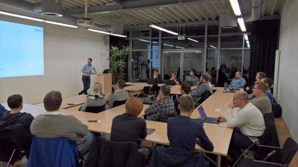

# LNGN-Agile-Meetup

Das LNGN Agile Meetup diskutiert regelmäßig Themen rund um moderner Softwareentwicklung und Agilen Methoden. Regelmäßig wechselnde Speaker und die Möglichkeit sich jederzeit einzubringen machen das Meetup zu einem idealen Ort zur persönlichen Weiterentwicklung und zum Netzwerken. Unsere Veranstaltungen finden einmal im Quartal im IT-Zentrum Lingen statt. Wenn Ihr über die neusten Veranstaltungen informiert werden wollt, könnt Ihr gerne den [RSS-Feed](https://github.com/lngn-agile-meetup/lngn-agile-meetup.github.io/commits/master.atom) abonnieren. Wir freuen uns über deine Teilnahme.

Viele Grüße 
Ben und Marcel

## Termine 2018

### 24. September 2018

* Lightning Talks rund um verschiedenen Ticketsysteme
* [XING Veranstaltung](https://www.xing.com/events/lngn-agile-meetup-1979291)
* [Zusammenfassung](meetups/20180924-meetup11-ticketsysteme)

__Veranstaltungsort:__ IT-Zentrum Lingen, Kaiserstraße 10b, 49809 Lingen (Ems) __Uhrzeit:__ 19:00 Uhr

### ~~8. Mai 2018~~ verschoben auf den 30. Mai 2018

* Benjamin Wolters - Agiles Requirements Engineering
* Sebastian Rakel - Toolchain Jenkins
* [XING Veranstaltung](https://www.xing.com/events/lngn-agile-meetup-1949515)

__Veranstaltungsort:__ IT-Zentrum Lingen, Kaiserstraße 10b, 49809 Lingen (Ems) __Uhrzeit:__ 19:00 Uhr

### 6. März 2018

* Marcel Thole - Gitlab [Slides](https://talks.marcelthole.de/toolchains/gitlab.html)
* [XING Veranstaltung](https://www.xing.com/events/lngn-agile-meetup-nine-1915601)
* [Zusammenfassung](meetups/20180306-meetup9-gitlab)

__Veranstaltungsort:__ IT-Zentrum Lingen, Kaiserstraße 10b, 49809 Lingen (Ems) __Uhrzeit:__ 18:30 Uhr

## Termine 2017

### 28. November 2017 - CLEAN CODE Special

* Björn Meschede - Clean Code: A Hitchhiker's Guide
* [XING Veranstaltung](https://www.xing.com/events/lngn-agile-meetup-clean-code-special-1873530)
* [Zusammenfassung](meetups/20171128-meetup8-cleancode)

__Veranstaltungsort:__ IT-Zentrum Lingen, Kaiserstraße 10b, 49809 Lingen (Ems) __Uhrzeit:__ 18:00 Uhr

### 5. Oktober 2017

* Patrick Blom - Agile Arbeitsweise 
* Benjamin Wolters - Retrospektive
* [XING Veranstaltung](https://www.xing.com/events/lngn-agile-meetup-1853207)

__Veranstaltungsort:__ IT-Zentrum Lingen, Kaiserstraße 10b, 49809 Lingen (Ems) __Uhrzeit:__ 18:30 Uhr

### 13. Juli 2017

Ein  Special: Guerilla Kanban von Christoph Meyer.

* Benjamin Wolters - Guerilla Kanban
* [XING Veranstaltung](https://www.xing.com/events/lngn-agile-meetup-1833581)
* [Zusammenfassung](meetups/20170713-meetup6-guerillakanban)

__Veranstaltungsort:__ IT-Zentrum Lingen, Kaiserstraße 10b, 49809 Lingen (Ems) __Uhrzeit:__ 18:00 Uhr

### 27. April 2017

* Retrospektiven
* Künstliche Neuronale Netze
* Docker Compose
* [XING Veranstaltung](https://www.xing.com/events/lngn-agile-meetup-five-1811313)

__Veranstaltungsort:__ IT-Zentrum Lingen, Kaiserstraße 10b, 49809 Lingen (Ems) __Uhrzeit:__ 18:00 Uhr

## Termine 2016

### 24. November 2016
* Marcel Thole - Docker in Action [Slides](https://talks.marcelthole.de/docker/)
* [XING Veranstaltung](https://www.xing.com/events/docker-action-lngn-agile-meetup-four-1745326)
* [Zusammenfassung](meetups/20161124-meetup4-docker)

__Veranstaltungsort:__ IT-Zentrum Lingen, Kaiserstraße 10b, 49809 Lingen (Ems) __Uhrzeit:__ 18:00 Uhr

### 30. August 2016
* Case Study über das Testframework Testlink
* Large Agile Frameworks LeSS, Nexus und SAFe 
* Case Study aus dem Kernkraftwerk Emsland - [Präsentation](assets/2016_08_30_KUB.ppsx)

__Veranstaltungsort:__ IT-Zentrum Lingen, Kaiserstraße 10b, 49809 Lingen (Ems) __Uhrzeit:__ 18:00 Uhr

### 26. Mai 2016
* Netzwerken und Ausrichtung

__Veranstaltungsort:__ IT-Zentrum Lingen, Kaiserstraße 10b, 49809 Lingen (Ems) __Uhrzeit:__ 18:00 Uhr

### 14. März 2016
* Netzwerken und Ausrichtung

__Veranstaltungsort:__ IT-Zentrum Lingen, Kaiserstraße 10b, 49809 Lingen (Ems) __Uhrzeit:__ 18:00 Uhr

