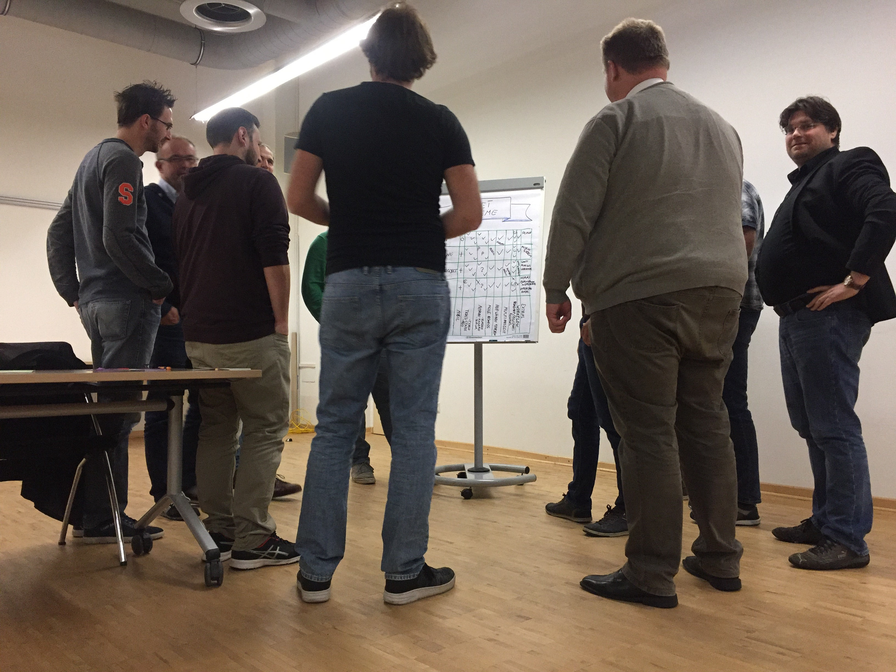
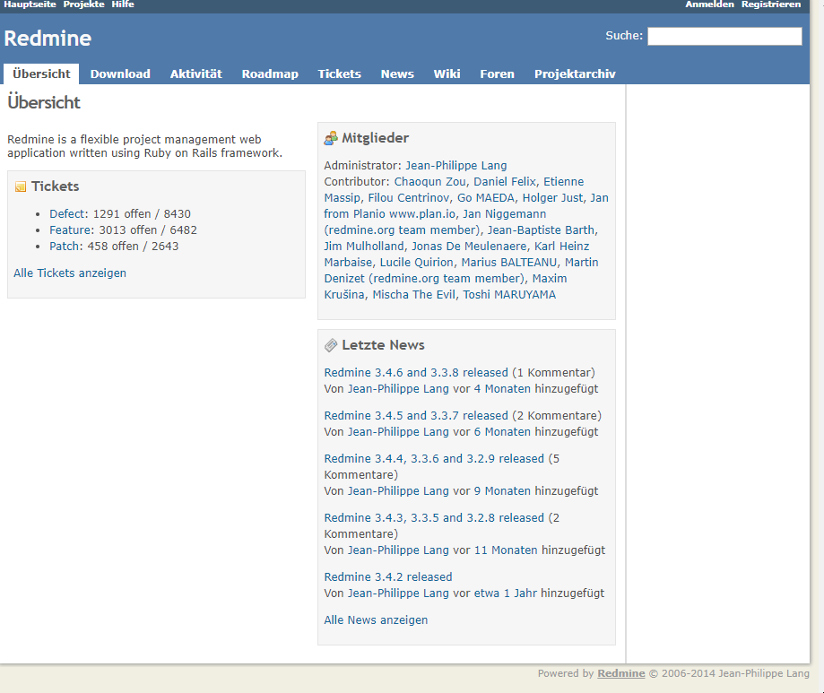
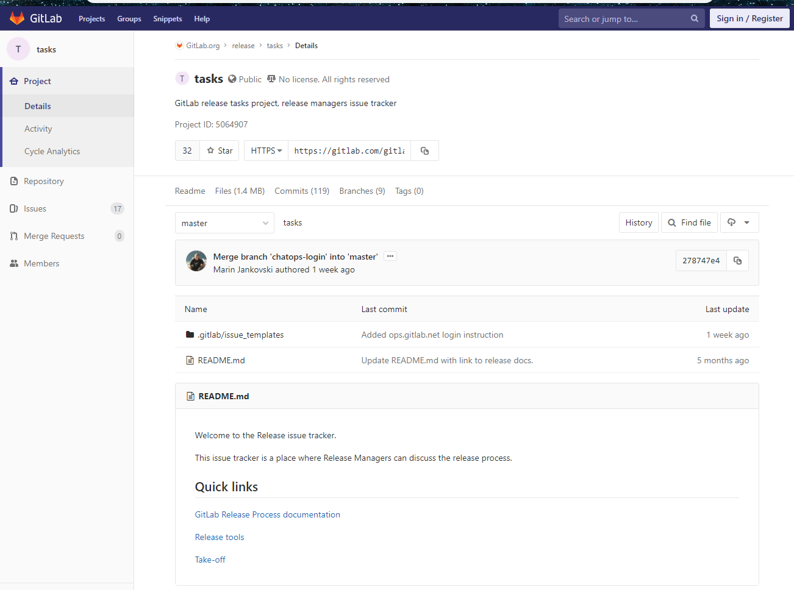
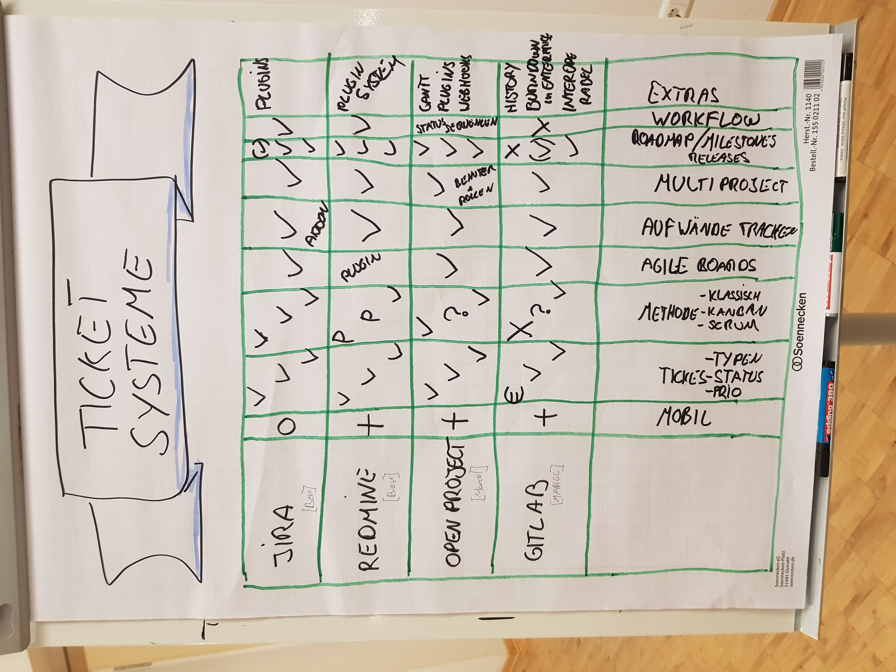
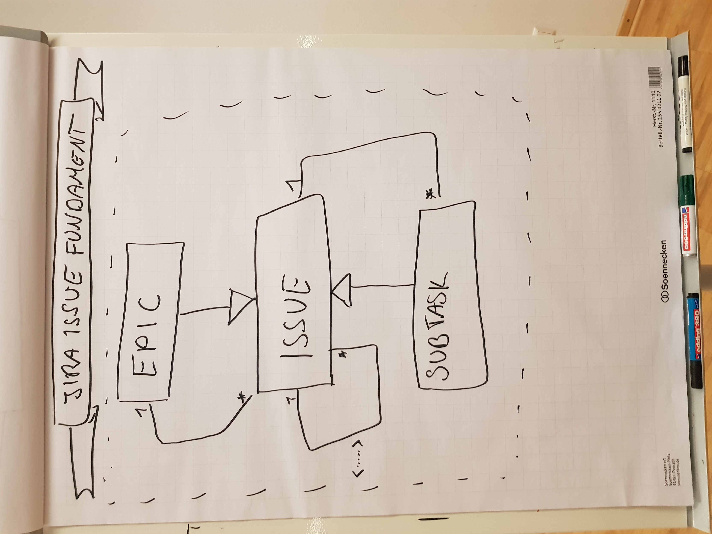
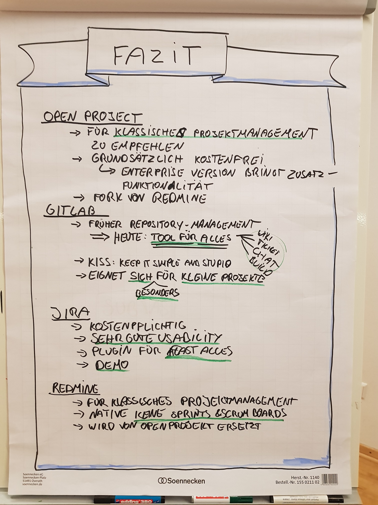

# LNGN Agile Meetup 
##Vergleich mehrerer Ticketsysteme im Agilen Management

Agiles Management in entsprechenden Projekten erfordert eine oder mehrere Varianten zum Aufgabentracking. Im elften Agilen Meetup verglichen wir eine Auswahl an Ticketsystemen. Mehrere Teilnehmer bereiteten die Systeme OpenProject, Atlassian JIRA, Gitlab und Redmine vor.
- OpenProject ist, wie der Name schon mitteilt, ein quelloffenes System zum Management von Projekten. Dazu eignet sich OP sowohl für Softwareprodukte als auch für jede Art weiterer Produkte. OP ist ein Fork von Redmine.
- Atlassian JIRA ist ein Produkt der Atlassian AG/Corp und damit das einzige proprietäre System im Vergleich. JIRA wird in vielen Unternehmen zum Aufgabentracking verwendet und zeichnet sich durch Usability und Funktionsumfang aus.
- Gitlab, ursprünglich eine System zur Quellvodeverwaltung und GIT-Repository, möchte sich zum Open Source Marktführer für jede Anforderung an Projektmanagement entwickeln. Daher vereinheitlicht es Ticketsystem, Wiki, Repo-Management und Build Server.
- Redmine ist der Vorgänger von OpenProject. Jedoch zeichnet es sich durch einen ähnlichen Funktionsumfang aus. Eine schlichtere GUI und umfangreiche Konfigurationsmöglichkeit zeichnen Redmine aus.

Zudem existieren für jedes System Dienstleister, welche Hosting und Support für den AdHoc Einsatz. Somit können Teams auch ohne zusätzlichen Aufwand durch Wartung und Pflege die Systeme einsetzen.

 

In einer zweieinhalbstündigen Session ist jedem System 30 Minuten gewidmet worden. Dabei wurde Funktionsumfang, Usability, Kosten, Responsibility und Eignung für agile Vorgehen betrachtet. Als fünfte Variante organisieren wir unser Meetup durch ein physisches Scrum-Board. Sofern Teams physisch am selben Ort arbeiten, empfehlen wir grundsätzlich ein physisches Board, um Teambegegnungen und Motivation zu fördern. Abbildung 1 zeigt unser Board und zugleich die Agenda:

Abbildung1

Abbildung 2 bis 5 zeigen die GUI der betrachteten Systeme und sollen dem Leser zumindest ein Gefühl für die Usability geben.

  

  

In der Regel diskutieren die Teilnehmer direkt und viel miteinander. Um diese Informationsflut zu tracken moderieren Marcel Thole (Check24) und Benjamin Wolters (viadee) unsere Events per Flipchart oder Metaleinwand. Vor allem die Eingenschaften der Systeme wurden direkt festgehalten, Abbildung 6 zeigt das zugehörige Flipchart. Die Matrix listet vertikal die Systeme und horizontal die Eigenschaften Resposibility für den mobilen Einsatz, Art der Tickets, Eignung für Agilität, Aufwandsprotokollierung und Zusatzfunktionen. 

Hier Zeit sich, dass die vier Ticketsysteme dieselben Grundfunktionen implementieren. In den Details zeigt sich dann der Unterschied. Lediglich das Systeme Redmine bringt in der Grundfunktion keine Visualisierung eines Agile Boards mit. Jedoch kann dieses per Pluginsystem nachgerüstet werden.

Viele Grüße
Ben
